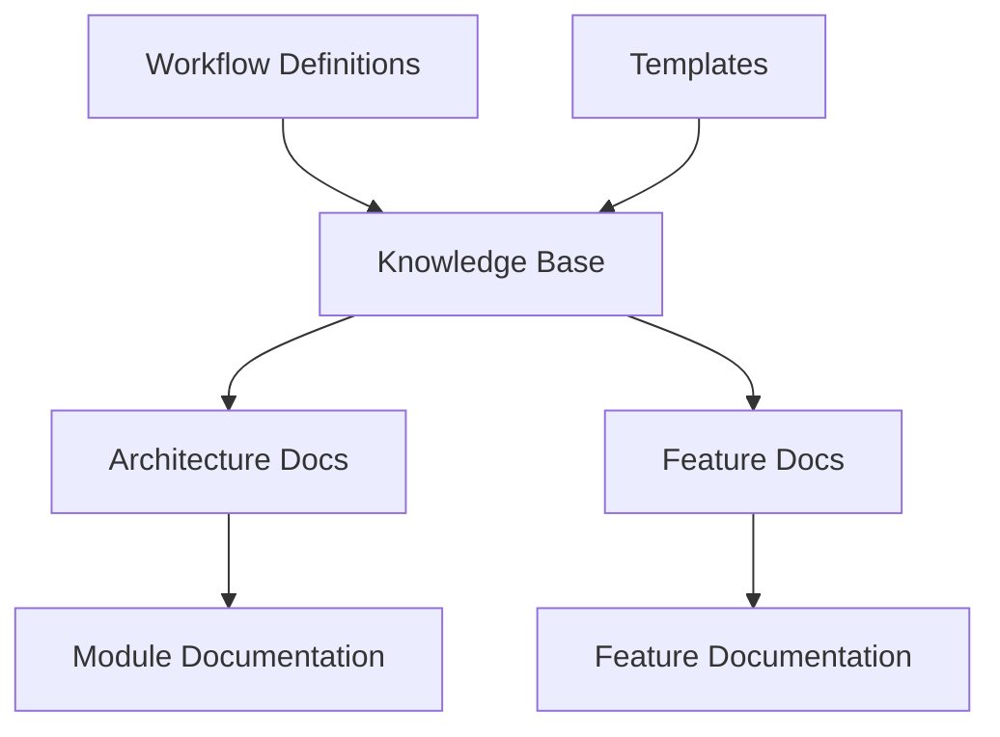

# Rules Template Structure

## 1. Overview & Business Context
- **Module Name**: Rules Template
- **Project**: Rules Template
- **Brief Description**: A framework for managing and documenting architectural rules and workflows.
- **Business Purpose**: Serves as a template repository to establish consistent documentation practices across projects.
- **Key Features**:
  - Standardized documentation structure
  - Workflow management
  - Template-based documentation
  - Documentation validation
  - Knowledge base organization

## 2. Architecture Diagram

- **Diagram Explanation**: The system uses workflow definitions and templates to generate and maintain documentation in the knowledge base, which is organized into architecture and feature documentation.

## 3. Components & Responsibilities

### 3.1 Component: Knowledge Base
- **Description**: Central repository for all project documentation
- **Key Responsibilities**:
  - Store architecture documentation
  - Maintain feature documentation
  - Organize documentation by module
- **Location**: `/knowledge-base/`
- **Subcomponents**:
  - `architecture-docs/`: Module-specific architecture documentation
  - `feature-docs/`: Feature-specific documentation

### 3.2 Component: Workflow Management
- **Description**: Contains workflow definitions and documentation processes
- **Key Responsibilities**:
  - Define documentation processes
  - Standardize workflow execution
  - Maintain workflow documentation
- **Location**: `/workflow/`
- **Key Files**:
  - `architecture-documentation-workflow.md`: Architecture documentation process

### 3.3 Component: Templates
- **Description**: Template files for various documentation types
- **Key Responsibilities**:
  - Provide standardized document structures
  - Ensure consistency across documentation
  - Support multiple documentation types
- **Location**: `/templates/`

## 4. Data Flow
- **Documentation Creation Flow**:
  1. Workflow definitions guide the process
  2. Templates provide structure
  3. Documentation is generated in knowledge base
- **Documentation Update Flow**:
  1. Changes follow workflow guidelines
  2. Updates are tracked in version control
  3. Documentation is validated against templates

## 5. Key Workflows
### 5.1 Architecture Documentation
- **Trigger**: New module creation or documentation update needed
- **Steps**:
  1. Select appropriate workflow
  2. Use templates for documentation
  3. Generate documentation in knowledge base
  4. Validate documentation completeness
- **Outcome**: Complete, standardized documentation

## 6. Dependencies
### 6.1 Internal Dependencies
- **Git**: Version control and history tracking
- **Markdown**: Documentation format
- **Templates**: Documentation structure

### 6.2 External Dependencies
- **Documentation Tools**: Markdown processors, linters
- **Workflow Tools**: As defined in specific workflows

## 7. Scalability Considerations
- Modular documentation structure allows for easy expansion
- Template-based approach ensures consistency at scale
- Version control supports collaborative documentation

## 8. Security Considerations
- Documentation access controlled through git permissions
- Version history maintains audit trail
- No sensitive information in templates

## 9. Integration Points
- Git-based workflow integration
- Template system integration
- Documentation validation integration

## Document History
- **Version**: 2.0
- **Last Updated**: 2024-03-19
- **Updated By**: AI Assistant
- **Changes**: Updated to new template format while preserving existing information 