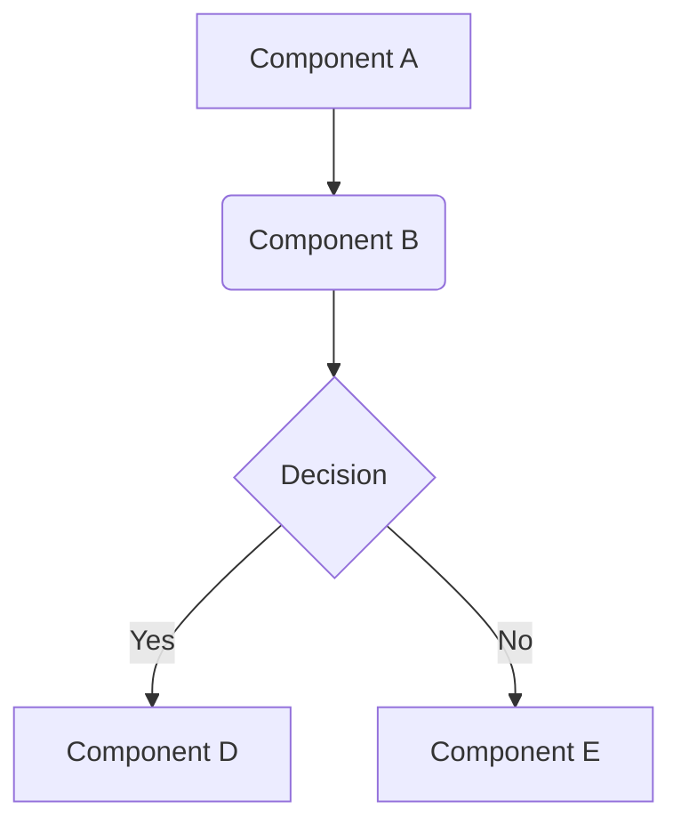

# {Service}/{Module} Structure

## 1. Overview & Business Context
- **Module Name**: {Module Name}
- **Project**: {Project Name}
- **Brief Description**: [A one-sentence description of the module's primary function.]
- **Business Purpose**: [Refer to or summarize content from `purpose.md`. How does this module contribute to business objectives?]
- **Key Features**: [List 3-5 key features or capabilities of this module.]

## 2. Architecture Diagram
[Embed or link to a Mermaid diagram or other visual representation of the module's architecture. This should show major components and their interactions.]

- **Diagram Explanation**: [Briefly explain the diagram, highlighting key flows and component roles.]

## 3. Components & Responsibilities
[Detail each major component within the module.]

### 3.1 Component: [Component Name 1]
- **Description**: [What this component does.]
- **Key Responsibilities**:
    - Responsibility A
    - Responsibility B
- **Key Technologies Used**: [Specific tech if noteworthy for this component, e.g., a specific library]
- **Interfaces/APIs Exposed**: [APIs this component provides to others]
- **Interactions**: [How it interacts with other components listed here or external services]

### 3.2 Component: [Component Name 2]
- **Description**: ...
- **Key Responsibilities**: ...
...

## 4. Data Flow
- **High-Level Data Flow**: [Describe the main data paths through the module. How data is ingested, processed, stored, and outputted.]
- **Data Models/Entities**: [Key data structures or entities managed by this module. (Can link to more detailed schema definitions if they exist elsewhere).]
- **Data Storage**: [Briefly mention how and where data is stored (e.g., specific tables in a DB detailed in `tech-stack.md`).]

## 5. Key Workflows / Use Cases
[Describe a few critical workflows or use cases that this module handles. This helps understand the module in action.]
### 5.1 Workflow: [Workflow Name 1]
- **Trigger**:
- **Steps**:
- **Outcome**:

## 6. Dependencies
### 6.1 Internal Dependencies
[Other modules/services within the same project/system that this module depends on.]
- **[Dependency Name 1]**: [Reason for dependency, critical interaction points]
- **[Dependency Name 2]**: ...

### 6.2 External Dependencies
[External services, APIs, or libraries that this module relies on.]
- **[Dependency Name 1]**: [Reason for dependency, version (if critical and not covered in tech-stack.md), impact of unavailability]
- **[Dependency Name 2]**: ...

## 7. Scalability & Performance Considerations
[Brief notes on how the module is designed for scalability and performance, or known bottlenecks.]

## 8. Security Considerations
[High-level security aspects specific to this module's architecture, e.g., authentication mechanisms used, data sensitivity.]

## 9. Integration Points
[Summary of key integration points with other systems/modules, both inbound and outbound.]

## 10. Task Tracking & Business Context
- **Related Business Initiatives/Epics**: [Link to JIRA epics, PRDs, or other business context documents.]

## 11. Non-Standard Architecture Elements
[Document architectural aspects that don't fit typical categories but are important:]
- **Event-Driven Patterns**: [Custom event handling, message queues, event sourcing implementations]
- **State Management**: [Complex state machines, distributed state, caching strategies]
- **Batch Processing**: [Scheduled jobs, data pipelines, ETL processes]
- **Real-time Components**: [WebSocket connections, streaming data, live updates]
- **Background Workers**: [Async task processors, job queues, scheduled operations]
- **Circuit Breakers**: [Fault tolerance patterns, retry mechanisms, fallback strategies]
- **Multi-tenancy Architecture**: [Tenant isolation, shared vs. dedicated resources]
- **A/B Testing Infrastructure**: [Feature flags, experiment frameworks, analytics collection]

## 12. Operational Aspects
[Runtime and operational considerations:]
- **Health Checks**: [How system health is monitored and reported]
- **Graceful Shutdown**: [How the module handles shutdown procedures]
- **Resource Management**: [Memory, CPU, connection pooling considerations]
- **Configuration Management**: [How configuration is handled, environment-specific settings]
- **Backup & Recovery**: [Data backup strategies, disaster recovery procedures]

## 13. Development & Deployment Considerations
- **Local Development Setup**: [Special considerations for running locally]
- **Testing Environments**: [How test environments differ from production]
- **Feature Flags**: [How new features are controlled and rolled out]
- **Blue-Green Deployments**: [If applicable, how deployments are managed]
- **Database Migrations**: [How schema changes are handled]

## 14. Special Architectural Considerations
[Catch-all for unique architectural elements:]
- **Legacy Integration Patterns**: [How legacy systems are integrated, adapter patterns used]
- **Compliance Architecture**: [GDPR data flows, audit trails, data retention policies]
- **Geo-distributed Considerations**: [Multi-region deployments, data locality, latency optimization]
- **Cost Optimization Patterns**: [Resource sharing, auto-scaling, serverless components]
- **Experimental Features**: [Beta features, canary deployments, prototype integrations]
- **Technical Debt Areas**: [Known architectural compromises and planned improvements]

## Additional Context
[For any structural information that doesn't fit the above categories:]
- Historical architecture decisions and their rationale
- Temporary architectural solutions and migration plans
- Cross-team coordination points and shared ownership areas
- Performance benchmarks and optimization targets
- Lessons learned from production incidents or scaling challenges

## Document History
- **Version**: 1.0
- **Last Updated**: YYYY-MM-DD
- **Updated By**: [Name/Team]
- **Changes**: [Initial Draft / Specific changes made]